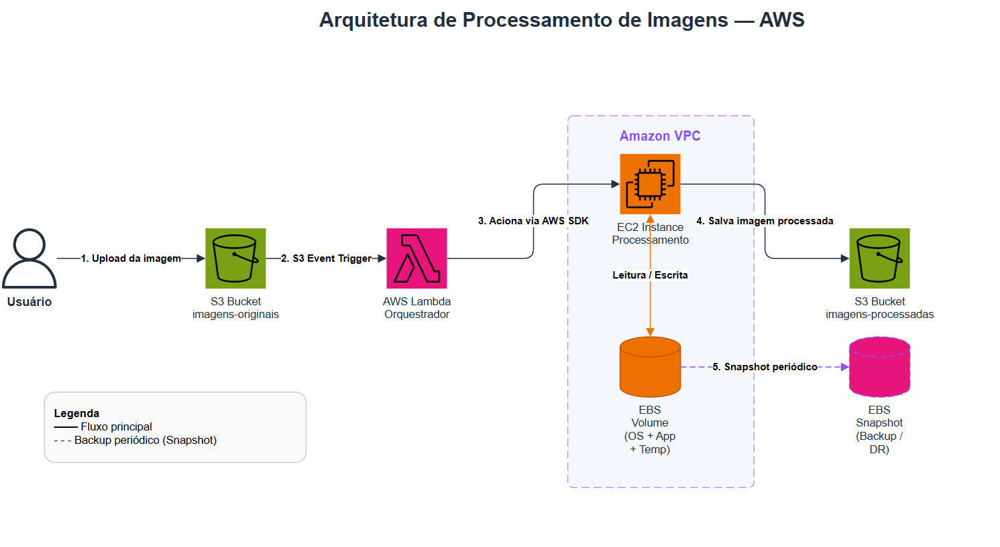

# GFT - Fundamentos de Cloud com AWS

Desafio do curso **GFT - Fundamentos de Cloud com AWS** na [DIO](https://www.dio.me/).

## Cenário

Pipeline de processamento de imagens utilizando serviços AWS.

## Diagrama

> Arquivo editável: `arquitetura-aws.drawio`

---

## Elementos da Arquitetura

| Elemento | Descrição |
|---|---|
| **Usuário** | Origem do fluxo — realiza o upload da imagem |
| **S3 — imagens-originais** | Bucket de entrada; armazena as imagens brutas enviadas pelo usuário |
| **AWS Lambda** | Função serverless que orquestra o fluxo; só executa quando acionada por evento |
| **Amazon VPC** | Rede virtual isolada que envolve a EC2 e o EBS, controlando o tráfego de rede |
| **EC2 Instance** | Instância que executa a aplicação de processamento pesado (filtros, OCR, etc.) |
| **EBS Volume** | Disco persistente da EC2; armazena o SO, a aplicação e arquivos temporários |
| **S3 — imagens-processadas** | Bucket de saída; armazena as imagens após o processamento |
| **EBS Snapshot** | Cópia de segurança periódica do volume EBS para recuperação em caso de falha |

---

## Interações

| # | De → Para | Tipo | Descrição |
|---|---|---|---|
| 1 | Usuário → S3 (originais) | Upload | Usuário envia a imagem para o bucket de entrada |
| 2 | S3 (originais) → Lambda | S3 Event Trigger | A chegada do arquivo dispara automaticamente a função Lambda |
| 3 | Lambda → EC2 | AWS SDK | Lambda aciona a EC2 via AWS SDK para iniciar o processamento |
| 4 | EC2 ↔ EBS | Leitura / Escrita | EC2 lê a aplicação e grava arquivos temporários no volume EBS durante o processamento |
| 5 | EC2 → S3 (processadas) | Gravação | EC2 salva a imagem processada no bucket de saída |
| 6 | EBS → EBS Snapshot | Snapshot periódico | Backup automático do volume EBS armazenado internamente pela AWS |

---

## Aprendizados

### EC2 (Elastic Compute Cloud)
Máquina virtual na nuvem com controle total sobre SO, runtime e configurações. Ideal para workloads que exigem processamento contínuo ou customização de ambiente — ao contrário do Lambda, permanece ativa enquanto ligada e cobra por tempo de uso.

### S3 (Simple Storage Service)
Armazenamento de objetos altamente durável e escalável. Não é um sistema de arquivos: cada objeto é acessado por uma chave única dentro de um bucket. Eventos nativos (como `s3:ObjectCreated`) permitem acionar outros serviços automaticamente, sem polling.

### EBS (Elastic Block Store)
Volume de bloco persistente acoplado à EC2 — funciona como um HD externo na nuvem. Os dados sobrevivem a reinicializações da instância, mas o volume fica vinculado a uma única EC2 por vez e à mesma zona de disponibilidade.

### EBS Snapshot
Cópia incremental do volume EBS armazenada no S3 (gerenciado pela AWS). Apenas os blocos alterados desde o último snapshot são gravados, tornando o processo eficiente em custo e tempo. Útil para backup, migração entre regiões e criação de AMIs.

### Lambda
Execução de código orientada a eventos sem gerenciar servidor. Cobra apenas pelo tempo de execução (em ms) e escala automaticamente. Perfeito como orquestrador leve: recebe o evento do S3 e delega o processamento pesado para a EC2, mantendo cada serviço na sua responsabilidade.
